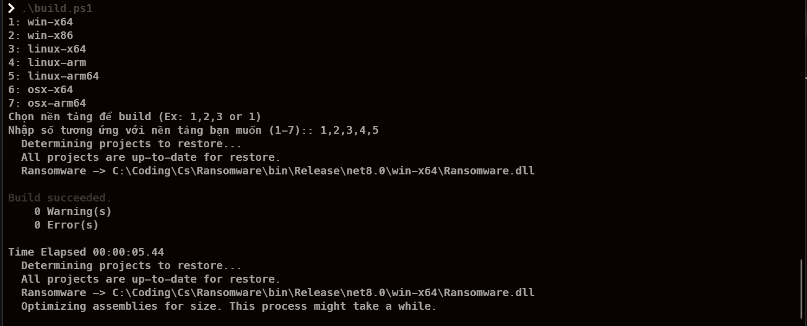

#  Ransomware

> [!WARNING]  
> **Chỉ chạy trong môi trường thử nghiệm!**  
> Để đảm bảo an toàn, hãy sử dụng máy ảo hoặc môi trường cách ly để thử nghiệm phần mềm này.
>
> **Rủi ro pháp lý:**  
> Việc phát tán hoặc sử dụng `ransomware` có thể dẫn đến hậu quả pháp lý nghiêm trọng. Bạn hoàn toàn chịu trách nhiệm về bất kỳ hành động nào của mình.

## What is Ransomware

**Ransomware** là một loại phần mềm độc hại, sau khi lây nhiễm vào máy tính, mã hóa hoặc chặn truy cập dữ liệu trên đĩa và sau đó thông báo cho nạn nhân về khả năng khôi phục chúng. Tất nhiên, không miễn phí và cần phải chuyển tiền vào tài khoản được chỉ định.

### Features

- Chạy ngầm (hoặc có thể không chạy ngầm, tùy thiết lập)
- Quét toàn bộ các ổ đĩa trên hệ thống theo mặc định
- Mã hóa tệp bằng chuẩn `AES-256` để đảm bảo tính bảo mật cao
- Hỗ trợ `Multi-Thread` để cải thiện tốc độ xử lý và hiệu suất
- Bao gồm công cụ giải mã để mở khóa các tệp đã mã hóa
- Lưu dữ liệu vào `RAM` trước khi ghi vào tệp để tối ưu quá trình mã hóa
- Sử dụng `ProcessHollowing` để tiêm và thực thi shellcode trong tiến trình khác, cho phép thao tác nâng cao và thực thi mã ẩn.

### Building

#### 1. Cài đặt .NET SDK

Trước khi xây dựng, hãy đảm bảo bạn đã cài đặt .NET SDK. Bạn có thể tải xuống từ [MICROSOFT](https://dotnet.microsoft.com/download).

#### 2. Clone Dự Án

```bash
git clone https://github.com/PhcNguyen/Ransomware
cd Ransomware
```

#### 3. Tools Build 

- **Windows**
    ```bash
    .\build.ps1
    ```
    <div align="center">
        
        <p><em>Build Ps</em></p>
    </div>

- **Linux/MacOS**
  
    ```bash
    chmod +x build.sh && ./build.ps1
    ```
    


#### 4. Build cho các nền tảng

| **Nền tảng**     | **Lệnh**                                                                          |
|------------------|-----------------------------------------------------------------------------------|
| **Windows**      | `dotnet publish ransomware.csproj -c Release -r win-x64 -o ./bin/win-x64         `|
|                  | `dotnet publish ransomware.csproj -c Release -r win-x86 -o ./bin/win-x86         `|
| **Linux**        | `dotnet publish ransomware.csproj -c Release -r linux-x64 -o ./bin/linux-x64     `|
|                  | `dotnet publish ransomware.csproj -c Release -r linux-arm -o ./bin/linux-arm     `|
|                  | `dotnet publish ransomware.csproj -c Release -r linux-arm64 -o ./bin/linux-arm64 `|
| **macOS**        | `dotnet publish ransomware.csproj -c Release -r osx-x64 -o ./bin/osx-x64         `|
|                  | `dotnet publish ransomware.csproj -c Release -r osx-arm64 -o ./bin/osx-arm64     `|

> [!TIP]  
> **Khởi động ứng dụng sau khi build hoàn tất**  
> Sau khi hoàn tất quá trình build, bạn có thể chạy ứng dụng bằng cách tìm đến tệp đã xuất trong thư mục: **`~/Ransomware/bin`**

## Contacts

If you have any questions, please reach out to the developers at **PhcNguyen Developers**.

You can also contact me via Telegram: [phcnguyenz](https://t.me/phcnguyenz).